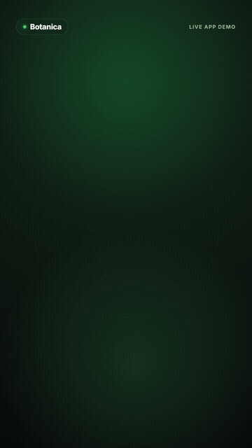
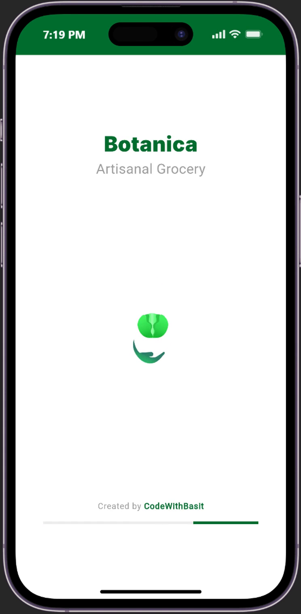
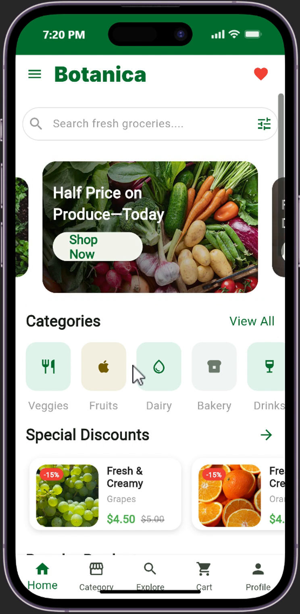
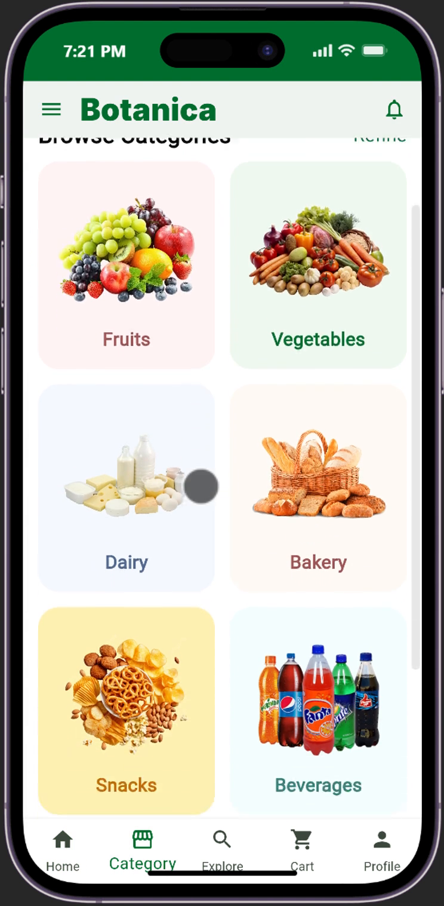
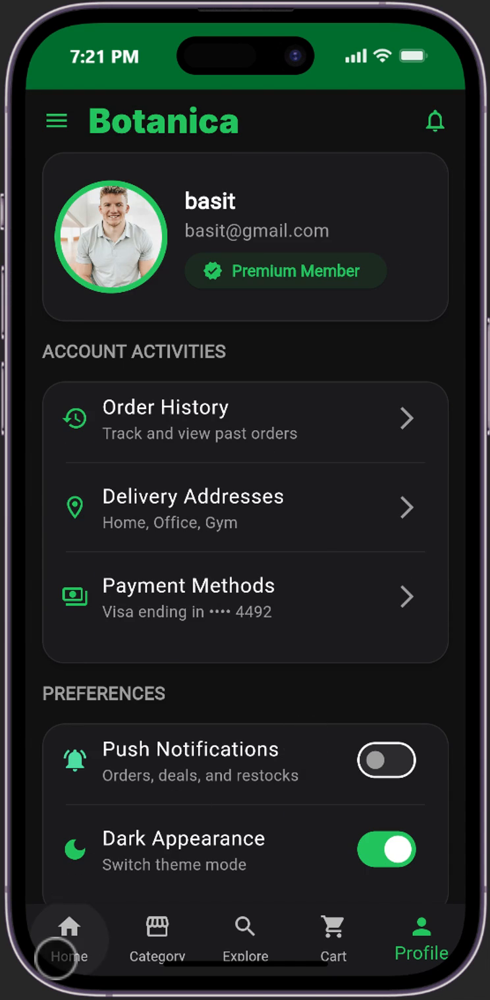
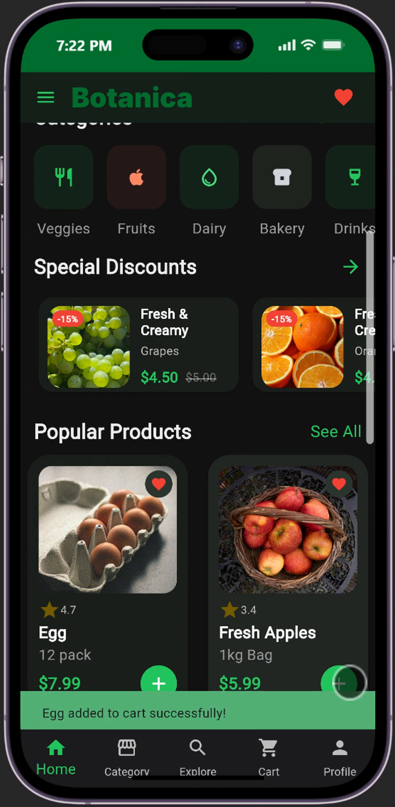
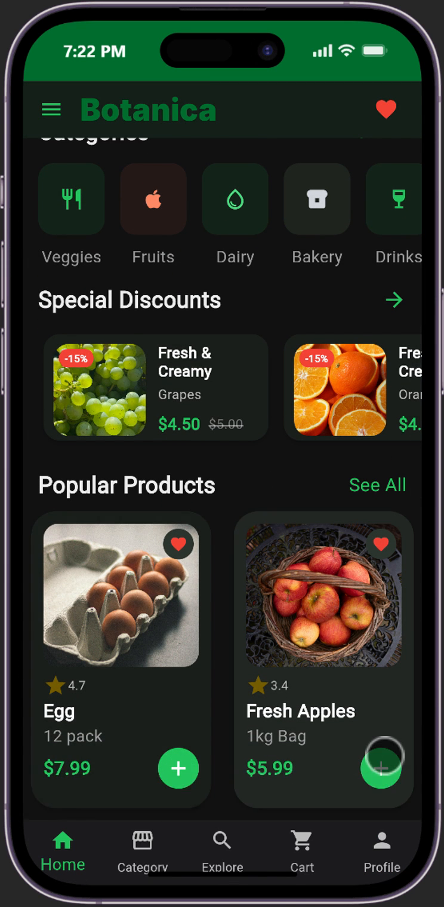

# 🌿 Botanica — Modern Organic Grocery E-Commerce App

<p align="center">
  
</p>

<p align="center">
  <b>Artisanal groceries and seasonal harvests delivered straight from local farms to your kitchen.</b><br>
  Built with Flutter & Dart for iOS and Android.
</p>

<p align="center">
  
  
  
  
</p>

---

## 🎬 20-Second App Launch Video

Watch the official 20-second launch showcase featuring the real Botanica mobile application in action:

<p align="center">
  <!-- Native Video Player for GitHub / Web Browsers -->
  <video src="docs/media/botanica-launch.mp4" width="380" controls poster="docs/media/botanica-launch.jpg">
    <a href="docs/media/botanica-launch.mp4">
      
    </a>
  </video>
</p>

<p align="center">
  <i>👉 If inline video playback is restricted in your viewer, <a href="docs/media/botanica-launch.mp4"><b>click here to view/download the full HD 1080x1920 MP4</b></a> or see the animated preview below:</i>
</p>

<p align="center">
  
</p>

---

## 📱 Real App UI Screens

Botanica features a natural botanical design system crafted with high attention to typography, fluid micro-interactions, and contrast:

### 🌞 Light Mode Experience

| Onboarding & Farm Story | Storefront & Deals | Departments & Categories |
| :---: | :---: | :---: |
|  |  |  |
| *Farm-to-table onboarding* | *Daily discounts & trending harvests* | *Artisanal departments* |

### 🌙 Botanica Dark Mode (OLED Optimized)

| Account & Theme Switcher | Home Feed (Dark) | Real-Time Cart & Checkout |
| :---: | :---: | :---: |
|  |  |  |
| *1-Tap Instant Theme Toggle* | *Deep contrast night shopping* | *Dynamic checkout summary* |

---

## ✨ Core Features & Highlights

* **Farm-to-Table Marketplace:** Handpicked seasonal fruits, vegetables, artisan bakery, dairy, and pasture items.
* **Seamless Dark Mode:** Instant OLED-friendly theme toggle with deep natural greens and crisp contrast.
* **Interactive Product Details:** Dynamic product detail navigation passing prices, weights, ratings, nutritional facts, and high-res imagery.
* **Capsule Quantity Counter:** Interactive quantity adjustment with smooth responsive state updates.
* **Instant Cart & Checkout:** Frictionless item addition, cart counter badge, and order review.
* **Clean Flutter Architecture:** Modular custom widgets, clean spacing tokens, and responsive constraints (`Stack`, `Row`, `Column`, `ClipRRect`).

---

## 🛠️ Tech Stack & Architecture

* **Framework:** [Flutter](https://flutter.dev/) (SDK ^3.5.3)
* **Language:** [Dart](https://dart.dev/)
* **State Management:** Reactive local state management (`StatefulWidget`, `setState`)
* **Styling System:** Custom botanical tokens (`BoxDecoration`, `LinearGradient`, soft layered `BoxShadow`)
* **Motion & Media:** Custom video engine & Hyperframes launch composition

---

## 🚀 Getting Started

### Prerequisites

* [Flutter SDK](https://docs.flutter.dev/get-started/install) installed on your machine
* Android Studio / Xcode / VS Code configured with Flutter extensions

### Installation

1. **Clone the repository:**
   ```bash
   git clone https://github.com/CodeWith-Basit/Botanica_Grocerry_App.git
   cd Botanica_Grocerry_App
   ```

2. **Install dependencies:**
   ```bash
   flutter pub get
   ```

3. **Run on an emulator or real device:**
   ```bash
   flutter run
   ```

---

## 📄 License & Credits

* **Developer:** [Basit](https://github.com/CodeWith-Basit)
* Built with passion using Flutter & Dart 🌿
